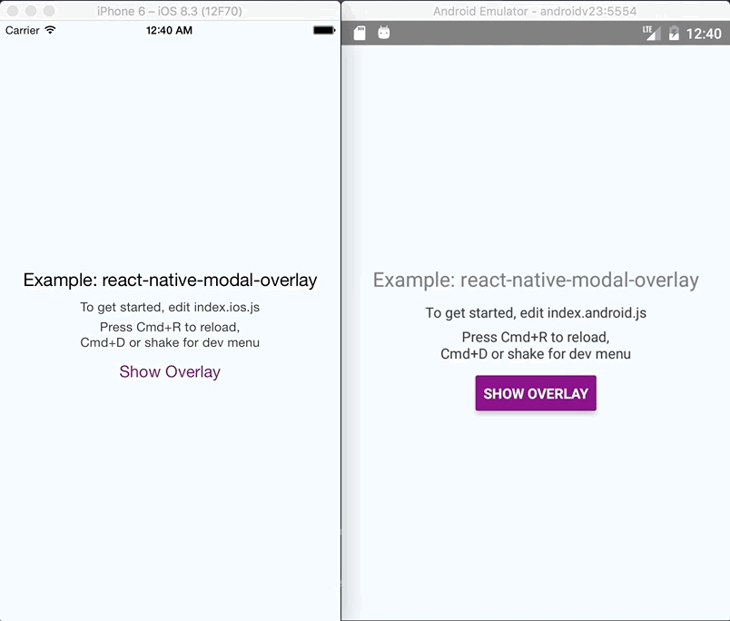

# react-native-modal-overlay 
An overlay component built using native Modal which can be invoked from anywhere in the component hierarchy.

[](https://www.npmjs.com/package/react-native-modal-overlay)

NPM URL- [https://www.npmjs.com/package/react-native-modal-overlay](https://www.npmjs.com/package/react-native-modal-overlay)
## Features
- Unlike other modal/overlay components, it can be triggered from anywhere in the component hierarchy since it is using react-native Modal.
- Used react-native components. So no linking is required.
- Works out of the box for both Android and IOS.
- Can be customised by passing style props.
- Supports `closeOnTouchOutside`.

## GIFs



## Props

This module accepts the following props:

| Prop   |Explanation| Default Value      |Type |
|----------|:------------------|:--------------|:--------------|
|`animationType`|Animation Type for modal/overlay. Can be any of the animations provided by [react-native-animatable](https://github.com/oblador/react-native-animatable). Example: `fadeInUp` `zoomIn`, `bounceIn`, `flipInX`, `lightSpeedIn`, etc.|'fadeIn'|string|
|`easing`|Timing function for the animation provided by [react-native-animatable](https://github.com/oblador/react-native-animatable)|'ease'|string|
|`visible`|Sets modal visibility|false|Boolean|
|`closeOnTouchOutside`|If modal should close on touching outside the child component|false|Boolean|
|`onClose`|Function to be called on close.|noop|Function|
|`containerStyle`|Style for the Overlay container.|{}|Object|
|`childrenWrapperStyle`| Style for children container.|{}|Object|
|`accessible`| Whether internal components should be declared as accessible. Useful for iOS XCUITest.|true|Boolean|


## Installation
`npm install react-native-modal-overlay --save` or if you are using Yarn, `yarn add react-native-modal-overlay`

## Examples:

### Simple usage with default props
```js
import React, { Component} from 'react';
import Overlay from 'react-native-modal-overlay';

export default class OverlayExample extends Component {
  state = {
    modalVisible: true, 
  }
  
  onClose = () => this.setState({ modalVisible: false});
  
  render() {
    return (
        <Overlay visible={this.state.modalVisible} onClose={this.onClose} closeOnTouchOutside>
          <Text>Some Modal Content</Text>
        </Overlay>
    );
  }
}
```

### Complex usage with [render props](https://reactjs.org/docs/render-props.html)

Use case: For Example you have a cross button inside your modal and you want to close the modal when the button is pressed. This can be done by calling hideModal argument in the [render props](https://reactjs.org/docs/render-props.html) instead of calling `onClose`. Refer to the example below:

```js
import React, { Component, Fragment} from 'react';
import Overlay from 'react-native-modal-overlay';

export default class OverlayExample extends Component {
  state = {
    modalVisible: true, 
  }
  
  onClose = () => this.setState({ modalVisible: false});
  
  render() {
    return (
      <Overlay visible={this.state.modalVisible} onClose={this.onClose} closeOnTouchOutside
        animationType="zoomIn" containerStyle={{backgroundColor: 'rgba(37, 8, 10, 0.78)'}}
        childrenWrapperStyle={{backgroundColor: '#eee'}}
        animationDuration={500}>
        {
          (hideModal, overlayState) => (
            <Fragment>
              <Text>Some Modal Content</Text>
              <Text onPress={hideModal}>Close</Text>
            </Fragment>
          )
        }
      </Overlay>
    );
  }
}
```

Note that the whole `hideModal` and `internal state` of the component is being passed as arguments to the render prop.


Example Project URL: [https://github.com/rgabs/react-native-modal-overlay-example](https://github.com/rgabs/react-native-modal-overlay-example)

Don’t forget to hit star if you like my work :)
